# Free and For Sale Web Application

[Click here to get started!]()

## Table of Contents
* [Overview](#Overview) 
* [How to user this site](#How-to-user-this-site) 
* [How our application work](#How-our-application-work)
* [How to install and deploy](#How-to-install-and-deploy) 

## Overview
Here at UCLA, students have stuff they wanna buy and sell. Although they can buy and sell in known markets, it is better off finding used items and selling their items to other UCLA students. That way, these items can be put into better use. Therefore, we created a marketplace web application just for UCLA students! In this site, students can find items they wanna buy and/or sell within the campus. This will help UCLA students to find their needs better and sell to the right person, at least to UCLA students who can have more benefit than strangers. 

In this site, users can...
* Create an account that manages all data, such as
  * Wishlist
  * Products that users are trying to sell
  * Products that users have sold
* Search through the product catalog with a simple filter by the type of product.
* Create product post, which gets added to the database
* Accessing all user's profile, which contains email, phone number, address, etc.
* A Map UI that has markers of all products within the proximity at UCLA

## How to user this site

Below will be a step-by-step guide on how to make use of this site.

1. Access the page through [here](https://www.google.com) and you will be redirected to the login page.
    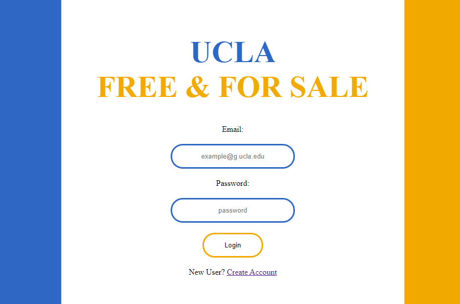
2. If you are a new user, you can create an account by just clicking "Create Account", which should redirect to this page:
    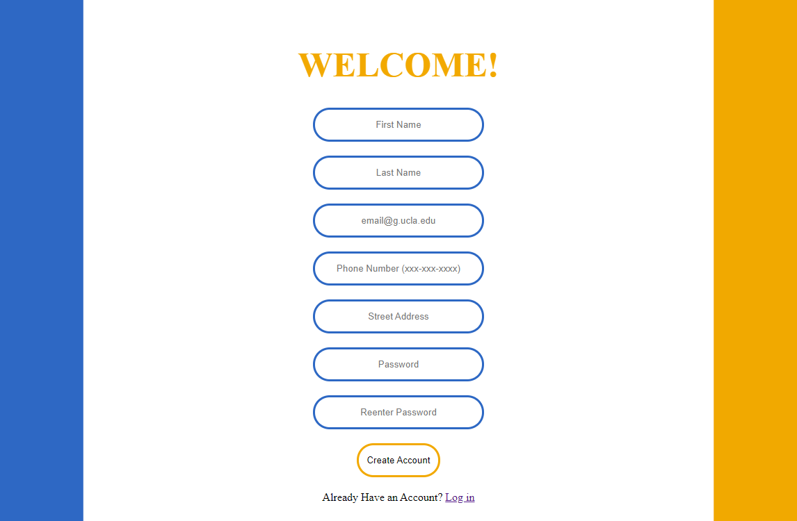
3. Once created, you should get an alert window that says account created, and will redirect you to the home page. If so, then log in to see if your account is created. If so, you should be able to be redirected to the catalog page, which looks like this:
    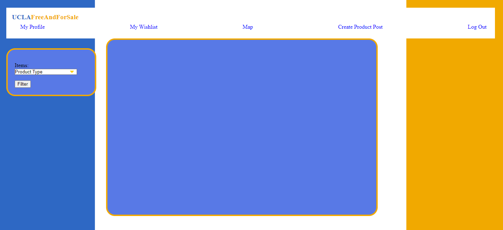

    for demonstration purposes, you can use the filter button to get the products by the type. Since we have some products in the database, here is what it looks like when users want to retrieve the products that are available by type.
    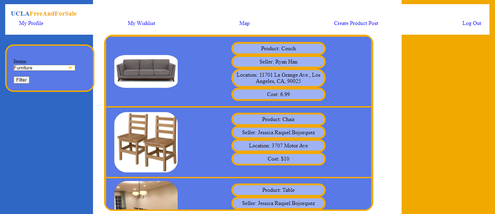
4. Let's go create a product post now! Click on "Create Product Post" on the navigation bar and you will be redirect to that page. Here, you can add all the description and add an image to the post so that other students can see them.
    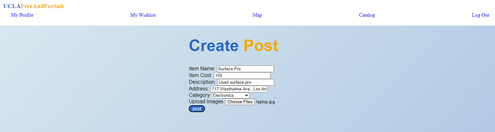
5. We can go back to the catalog and see that our product is available to the public!
    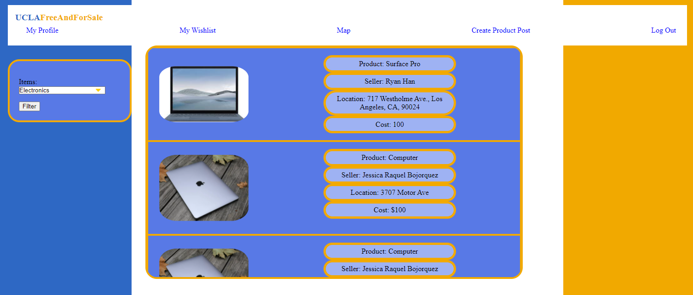
6. We can even look at the post. Just click on the image of the post and you can see all the details, such as product information, seller's information, and even a button to buy or add to your wishlist.
    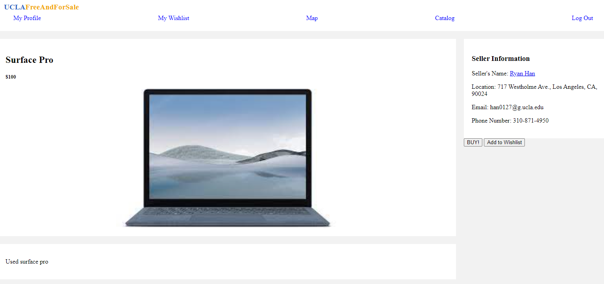

    Here is an example of your own profile, which contains all your information plus the product post you are trying to sell. User can also change profile image from here.
    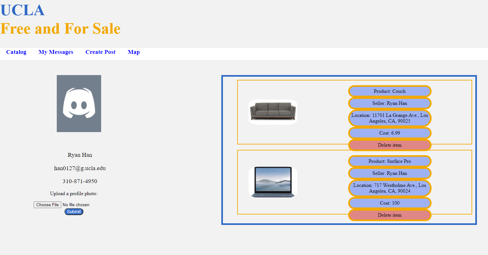
7. Let's say I want to save an item to my wishlist, and come back later when I decided I want to buy. If you saved the product through the post description and go to your "My Wishlist" in the navigation bar, you can see the item you saved and have the option to remove the item from your wishlist.
    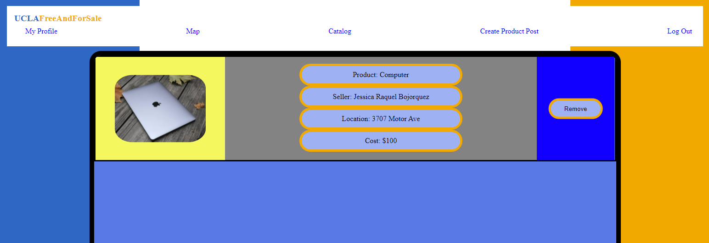
8. The last feature we have is the Map UI. Just click on "Map" in the navigation bar, and you will see two buttons. You must click "scan" and then "map", and if that is done in order, then you will a Google Maps UI with all the markers of the product. Click on the marker to see the product details and you can click on it to see the post description. This map UI is there to help students gauge their feasibility if traveling is a concern.
    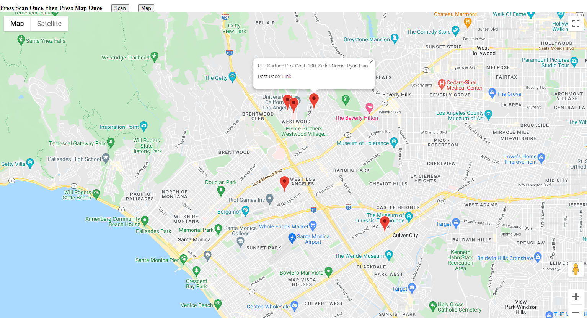
9. If you want to go buy the item now, just go to the description page and buy the item. If successful, you will redirected to the seller's profile and there you should contact them and notify that you have bought their item and negotiate how you want to pick up the item, and that's it!

## How our application work

Main Dependencies for this application
  * AWS Dynamo DB
    * Table data structure in the cloud
  * AWS S3 Bucket
    * File upload and download cloud service
  * Google Maps
    * API to make Google Maps with our custom markers

This sectio, however, will talk about AWS Dynamo DB mostly, since our application use this the most. This is web service that allow us to store all infomation in the cloud. Dynamo DB is like hash maps in many programming languages data structure, except tables do not need to have a predefined attributes. Below is a screenshot of our tables in AWS console we have for this application.
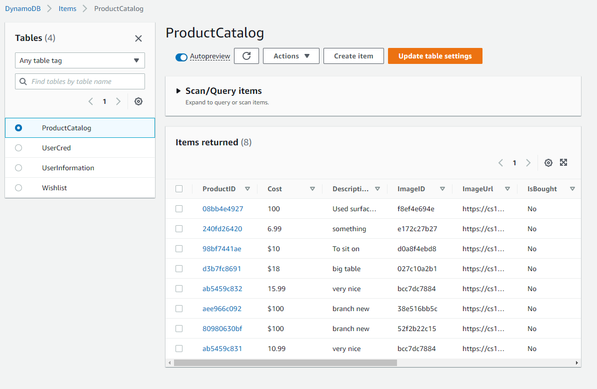

Below are all the tables and its attributes we use for this application
* `ProductCatalog`: A table of all product posts
  * Attributes
  ```
  {
      ProductID (String): Primary Key, product ID,
      Product (String): Product's name,
      ProductType (String): Type of the product,
      UserID (String): Seller's ID,
      SellerName (String): Seller's name,
      ImageID (String): Image ID of the product,
      ImageURL (String): Image URL to be attached to HTML img tag
      Cost (String): Product's cost,
      Location (String): Location of the product,
      Description (String): Description of the product,
      IsBought (String ["Yes", "No"]): A flag to signify if the item is bought or not
  }
  ```
* `UserCred`: A table of all user's credentials
  * Attributes
  ```
  {
      Email (String): Primary Key, user's email or also known as username,
      UserID (String): User's ID,
      Password (String): User's password
  }
  ```
* `UserInformation`: A table of all user's information
  * Attributes
  ```
  {
      UserID (String): Primary Key, user's ID,
      FirstName (String): User's first name,
      LastName (String): User's last name,
      Email (String): User's email,
      PhoneNumber (String): User's phone number,
      Address (String): User's address,
      ListofProductIDSelling (List[String]): List of products selling,
      ListofProductIDSold (List[String]): List of products sold,
      Wishlist (List[String]): List of product IDs in wishlist
  }
  ```
* `Wishlist`: A table of all users who added the product in their wishlist
  * Attributes
  ```
  {
      ProductID (String): Primary Key, product's ID,
      ListOfUsers (List[String]): List of user IDs that has the associated product
  }
  ```

Our application is based on CQRS strutural pattern. Whenever the user wants to get infomation, it will ask a read request to the database. Likewise, if the user wants to change something, such creating account, creating post, updating wishlist, etc., it will ask a write request to the database.

With this structural pattern, all these read and writes will be called by certain tasks. Thus, our main application is based on Facade design pattern. Whenever someone wants to create a post, we have to write to the database more than one table. Thus, a bunch of tasks is needed for most of actions.

Below are a few actions and the order of what happens when it gets triggered

* When a user creates an account
  1. Create user entry into user information table
  2. Create user credentials into user cred table
* When a user creates a post
  1. Get user information to extract name
  2. Get S3 Presigned URL and upload image to bucket
  3. Create new entry and write to Product Catalog Table
  4. Create Product Wishlist Watch
  5. Add product ID to user's selling product list
* When a user wants to add a product to their wishlist
  1. Get the current wishlist from user's information table
  2. Get the current wishlist watch from wishlist table
  3. Add product ID to their wishlist and update that to the user's entry
  4. Add user's ID to the wishlist watch and update that to the table
* When a user wants to use the map feature
  1. Scan all product entry from the product catalog table
  2. Generate the map, for each product
    1. Create a marker, attaching its information and a link to that post description
  3. Add that map into the HTML tag

## How to install and deploy

These are the steps on how to run this application locally. Make sure you have the newest version of Node.js installed.
1. Create your own AWS account (make sure you are in `us-west-1`, or at least in a region you want to work on)
    1. Create 4 tables called in Dynamo DB
        1. `ProductCatalog` with primary key `ProductID (String)`
            * Added Index by going into the catalog, look for "Index" tab, and find "Create Index", and create an index called `ProductType-index`
        2. `UserCred` with primary key `Email (String)`
        3. `UserInformation` with primary key `UserID (String)`
        4. `Wishlist` with primary key `ProductID (String)`
    2. Create an S3 Buckets called `cs130-bucket`
    3. Create an IAM Role in AWS that has access to Dynamo and S3
        * There are two credentials you need to save from this role. Put those down in a file so you wont forget.
    4. Add these credentials in `cs130-bucket`
        * Bucket policy
        ```
        {
            "Version": "2012-10-17",
            "Id": "Policy1645589243219",
            "Statement": [
                {
                    "Sid": "Stmt1645589242328",
                    "Effect": "Allow",
                    "Principal": "*",
                    "Action": "s3:*",
                    "Resource": "arn:aws:s3:::cs130-bucket/*"
                }
            ]
        }
        ```
        * CORS Policy
        ```
        [
            {
                "AllowedHeaders": [
                    "*"
                ],
                "AllowedMethods": [
                    "HEAD",
                    "GET",
                    "PUT",
                    "POST",
                    "DELETE"
                ],
                "AllowedOrigins": [
                    "*"
                ],
                "ExposeHeaders": []
            }
        ]
        ```
    5. Enable ACL in S3 Bucket
2. Create a role in Google Maps and save the API key somewhere so you won't forget
3. Clone this repository
4. Change directory into the repository
5. Create directory in root called `bundle`
6. Create `.env` file in root with the following content
    ```
    REGION=us-west-1
    ACCESS_ID=XXXXX
    ACCESS_KEY=XXXXX
    ENDPOINT=https://dynamodb.us-west-1.amazonaws.com
    MAPS_KEY=XXXXX
    ```
7. Run command `npm install`
    * This should create a folder called `node_modules` and should not fail when finished
8. Run command `npm run build`
    * If no errors come out when finished, there should be all the bundle files in the bundle folder
9. Open up `loginPage.html` and you have successfully installed and deployed this application locally and can start testing!